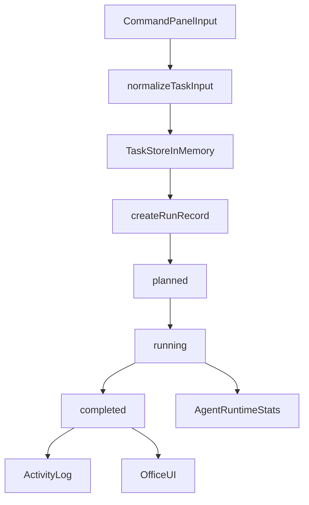

# Submit Task Flow

Topic: `task-runs`
Status: current first-slice flow

## Purpose

Normalize work requests from different entry points into one canonical task model and one canonical run lifecycle.

Current supported entry point:
- Web UI command panel

Model already reserves space for:
- ChatOps
- scheduled jobs

## Input

Current payload shape:

```json
{
  "sourceType": "web-ui",
  "sourceLabel": "Command panel",
  "command": "status report all agents",
  "requestedAgentId": "pa",
  "ai": {
    "provider": "gemini",
    "model": "gemini-2.5-pro",
    "apiKeyEnv": "GEMINI_API_KEY"
  },
  "scheduleId": null,
  "metadata": {}
}
```

## Current Flow



## Validation Rules

- `command` must not be empty
- `requestedAgentId` must point to an existing runtime agent
- task AI metadata is inherited from the selected agent runtime config

## State Transitions

Current lifecycle:

1. `received`
2. `planned`
3. `running`
4. `completed`

Future lifecycle can extend to:
- `failed`
- `cancelled`
- `degraded`

## Output

Successful submission produces:
- one stored `Task`
- one stored `Run`
- one activity log entry
- one agent stat update (`tasks`, `msg`, `status`)
- one AI execution reference on the task/run (`provider`, `model`, `apiKeyEnv`)

## Failure Cases

- empty command
- unknown requested agent

Current failure behavior:
- throw an error before creating a run

## Notes

- This first slice completes tasks immediately because there is not yet a separate GM orchestrator.
- Runs currently reference the selected agent AI config rather than resolving the real secret in-browser.
- When orchestration is introduced, this document should be updated to show `received -> planned -> delegated -> running -> completed/failed`.
